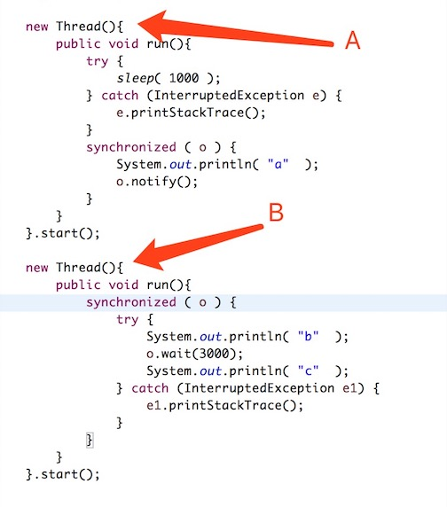

## java中超类Object

### 1. 先摆出java中Object的代码

```java

package java.lang;
public class Object {
    private static native void registerNatives();
    static {
        registerNatives();
    }
    public final native Class<?> getClass();
    public native int hashCode();
    public boolean equals(Object obj) {
        return (this == obj);
    }
    protected native Object clone() throws CloneNotSupportedException;
    public String toString() {
        return getClass().getName() + "@" + Integer.toHexString(hashCode());
    }
    public final native void notify();
    public final native void notifyAll();
    public final native void wait(long timeout) throws InterruptedException;
    public final void wait(long timeout, int nanos) throws InterruptedException{
        if (timeout < 0) {
            throw new IllegalArgumentException("timeout value is negative");
        }
        if (nanos < 0 || nanos > 999999) {
            throw new IllegalArgumentException(
                                "nanosecond timeout value out of range");
        }
        if (nanos > 0) {
            timeout++;
        }
        wait(timeout);
    }
    public final void wait() throws InterruptedException {
        wait(0);
    }
    protected void finalize() throws Throwable { }
}

```

### 2. 分析代码

我们发现用到了native修饰符和很多个函数。

先解释一下native。因为Java语言本身不能对操作系统底层进行访问和操作，但是可以通过JNI接口调用其他语言来实现对底层的访问。native修饰符说明其修饰的方法是一个原生态方法，方法对应的实现不是在当前文件，而是在用其他语言（如C和C++）实现的文件中。

如果对jni感兴趣的可以进一步研究

### 3. 各个方法的作用

- ***getClass*** ： 获取对象所属的类，最后派生出来的类。
- ***hashCode*** ： 对象的hash值
- ***equals*** ： 判断两个对象是否相等，默认是看两个对象只想的堆内存地址是否一样
- ***clone*** ： 浅复制，只不过把对象的引用复制了一下，也可以说栈中内存复制。 
- ***toString*** ： 对象转化成String，默认类命+16进制hash值
- ***notify*** ：持有对象锁的线程A准备释放对象锁权限，通知jvm唤醒某个竞争该对象锁的线程X
- ***notifyAll*** ：持有对象锁的线程A准备释放对象锁权限，通知jvm唤醒所有竞争该对象锁的线程
- ***wait*** ： 持有对象同步锁的线程A准备释放对象锁，释放cpu资源并进入等待,重新被唤醒后重新竞争获取锁。
- ***finalize*** ： 对象被gc前会调用

### 4. 注意
notify和wait方法应该放在被调用的对象的同步锁内执行


### 5. 题目

***输出结果***： bac。

***执行时间***：1s

***题解***：理论上线程A和线程B同时启动，此时A沉睡1s，那么B会先获取对象o的对象锁，输出b，然后B调用o.wait(3000)释放对象o的同步锁（这一部分理论上会在1s内执行完），并等待3s中，然后1s后线程A要获取o的同步锁，然后B也已经释放o的同步锁，所以A在1s后获取同步锁，然后输出字母a。此时调用o.notify()，唤醒了B线程，所以输出了c。相当于没等待3s线程B结束，恰钱等了1s吧。因此两个线程输出顺序bac，执行时间1s。


