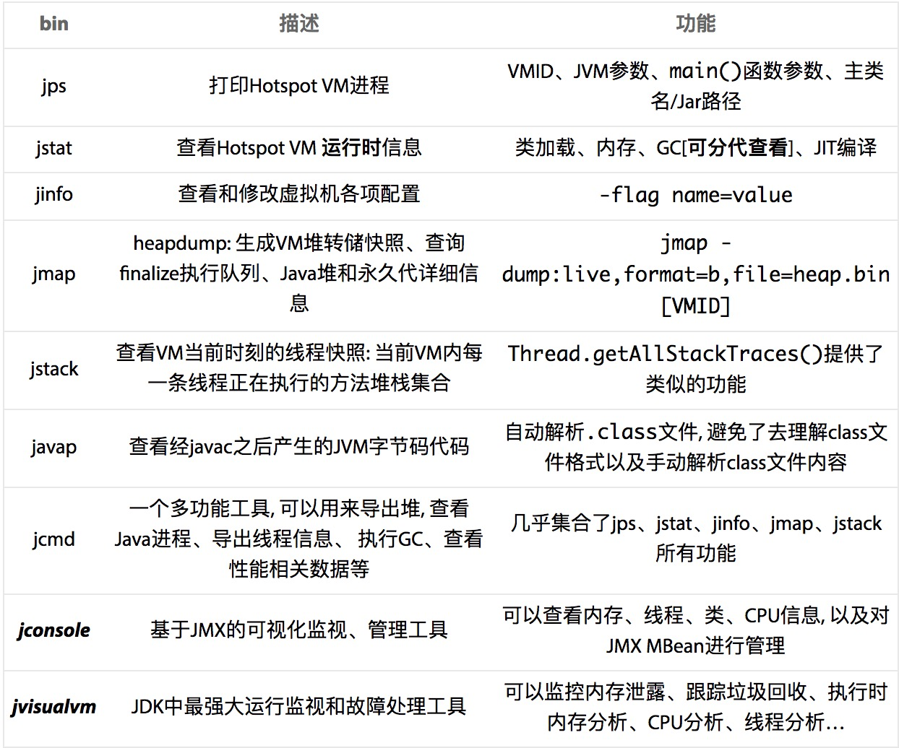

# VM常用参数整理

参数	描述

-Xms	最小堆大小

-Xmx	最大堆大小

-Xmn	新生代大小

-XX:PermSize	永久代(方法区)大小

-XX:MaxPermSize	永久代(方法区)最大大小

-XX:+PrintGC	输出GC日志

-verbose:gc	-

-XX:+PrintGCDetails	输出GC的详细日志

-XX:+PrintGCTimeStamps	输出GC时间戳(以基准时间的形式)

-XX:+PrintHeapAtGC	在进行GC的前后打印出堆的信息

-Xloggc:/path/gc.log	日志文件的输出路径

-XX:+PrintGCApplicationStoppedTime	打印由GC产生的停顿时间

-XX:ParallelGCThreads 控制GC线程数

-XX:+HeapDumpOnOutOfMemoryError 出现 OOME 时生成堆 dump

-XX:HeapDumpPath=/log/heapdump.hprof 堆dump文件地址

-XX:OnOutOfMemoryError="sh ~/cleanup.sh" 当OutOfMemory导致程序退出时重启应用，脚本需要自己写


-XX:+UseG1GC 启用G1收集器

# JVM小工具
在${JAVA_HOME}/bin/目录下Sun/Oracle给我们提供了一些处理应用程序性能问题、定位故障的工具




### 垃圾回收动作何时执行？

- 当年轻代内存满时，会引发一次普通GC，该GC仅回收年轻代。需要强调的时，年轻代满是指Eden代满，Survivor满不会引发GC
- 当年老代满时会引发Full GC，Full GC将会同时回收年轻代、年老代
- 当永久代满时也会引发Full GC，会导致Class、Method元信息的卸载

### 何时会抛出OutOfMemoryException，并不是内存被耗空的时候才抛出

- JVM98%的时间都花费在内存回收
- 每次回收的内存小于2%

### jinfo命令

查看jvm信息的命令

- jinfo -flags process_id    查看jvm的参数(就上面哪些-Xms参数)
- jinfo -sysprops process_id 查看java系统参数

### jps命令祥解

- 列出pid和java主类名

```
2017 Bootstrap
2576 Jps
```

- jps -l 列出pid和java主类全称

```
2017 org.apache.catalina.startup.Bootstrap
2612 sun.tools.jps.Jps
```

- jps -lm   列出pid、主类全称和应用程序参数

```
2017 org.apache.catalina.startup.Bootstrap start
2588 sun.tools.jps.Jps -lm
```

- jps -v   列出pid和JVM参数

```
2017 Bootstrap -Djava.util.logging.config.file=/usr/local/tomcat-web/conf/logging.properties
2624 Jps -Dapplication.home=/usr/lib/jvm/jdk1.6.0_43 -Xms8m
```

### jmap详解

- 查看整个JVM内存状态  jmap -heap [pid]   在使用CMS GC 情况下，jmap -heap的执行有可能会导致JAVA 进程挂起
- 查看JVM堆中对象详细占用情况  jmap -histo [pid]
- 导出整个JVM 中内存信息 jmap -dump:format=b,file=文件名.hprof [pid]

### jstack命令单独文章讲解

### java相关日志

tomcat日志

gc日志(给jvm添加启动参数JAVA_OPTS)

应用日志

dump文件(通过jvm启动参数设置出现oom时记录堆dump)

### tomcat日志

tomcat每次启动时，自动在logs目录下生产以下日志文件，按照日期自动备份

- ***localhost.2018-01-06.txt***   //经常用到的文件之一 ，程序异常没有被捕获的时候抛出的地方

- ***catalina.2018-01-06.txt***  //经常用到的文件之一，程序的输出，tomcat的日志输出等等

- ***manager.2018-01-06.txt*** //估计是manager项目专有的

- ***host-manager.2018-01-06.txt*** //估计是manager项目专有的

- ***localhost_access_log.2018-01-06.txt*** //tomcat访问日志记录，需要配置

### tomcat启动访问记录日志


默认 tomcat 不记录访问日志，如下方法可以使 tomcat 记录访问日志

编辑 {catalina}/conf/server.xml 文件. 注 {catalina} 是 tomcat 的安装目录

把以下的注释 (<!-- -->) 去掉即可。

        <Valve className="org.apache.catalina.valves.AccessLogValve"

         directory="logs"  prefix="localhost_access_log." suffix=".txt"

         pattern="common" resolveHosts="false"/>


  

