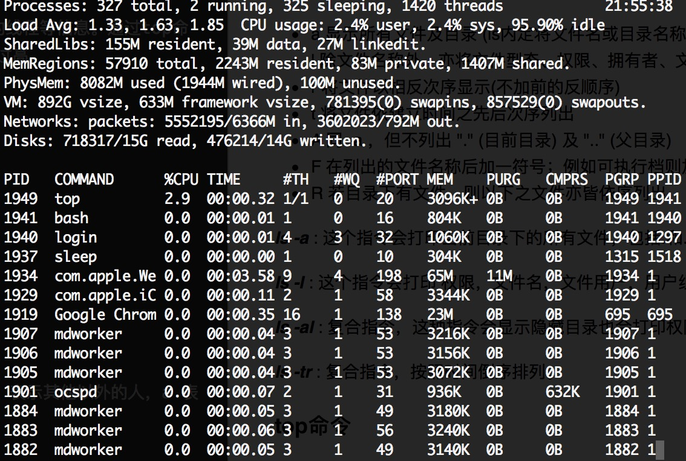

## Linux基础知识


### 查看linux电脑属性

查看cpu信息: cat /proc/cpuinfo 

可以查看到cpu的个数(physical id)，每个cpu的核数(cpu cores)，每个核有几个逻辑处理器(core id)。此电脑一共有多少个逻辑处理器(processor)。


可知此电脑一共两个cpu，每个cpu有4个核，每个核分成两个逻辑处理器，共16个处理器

### 查看memery信息:  cat /proc/meminfo

### 查看系统信息：uname -a

### 查看正在运行的内核版本: cat /proc/version


### ifconfig
查看ip相关属性

### whoami
查看当前会话所使用的用户名

### reboot
重启系统

### shutdown
关闭系统

### pwd
输出当前路径

### ls命令

参数

- a 显示所有文件及目录 (ls内定将文件名或目录名称开头为"."的视为隐藏档，不会列出)
- l 除文件名称外，亦将文件型态、权限、拥有者、文件大小等资讯详细列出
- r 将文件以相反次序显示(不加前的反顺序)
- t 将文件依建立时间之先后次序列出
- A 同 -a ，但不列出 "." (目前目录) 及 ".." (父目录)
- F 在列出的文件名称后加一符号；例如可执行档则加 "*", 目录则加 "/"
- R 若目录下有文件，则以下之文件亦皆依序列出

***ls -a*** : 这个指令会打印当前目录下的所有文件，包括.和.. ， 默认按照字母序排列。

***ls -l*** : 这个指令会打印 权限，文件名，文件用户，用户组，文件大小，修改时间，文件名等信息

***ls -al*** : 复合指令，这种指令会显示隐藏目录也会打印权限等信息。

***ls -tr*** : 复合指令，按照时间倒序排列。

### top命令

Linux系统可以通过top命令查看系统的CPU、内存、运行时间、交换分区、执行的线程等信息。通过top命令可以有效的发现系统的缺陷出在哪里。是内存不够、CPU处理能力不够、IO读写过高。



此命令类似于window下的任务管理器

可以看到最近的负载：1.33, 1.63. 1.85。cpu的使用率：2.4%，2.4%，95.9%。内存信息，各种进程信息。

按q退出监听。


### grep命令

强大的文本搜索工具，把匹配的行打印出来。可以使用正则表达式

##### grep命令使用简单实例

grep ‘test’ d*           显示所有以d开头的文件中包含 test的行。

grep ‘test’ aa bb cc     显示在aa，bb，cc文件中匹配test的行。

grep ‘[a-z]\{5\}’ aa     显示所有包含每个字符串至少有5个连续小写字符的字符串的行。

### chmod命令
u 表示该档案的拥有者，g 表示与该档案的拥有者属于同一个群体(group)者，o 表示其他以外的人，a 表示这三者皆是。

+表示增加权限、- 表示取消权限、= 表示唯一设定权限。 

r 表示可读取，w 表示可写入，x 表示可执行，X 表示只有当该档案是个子目录或者该档案已经被设定过为可执行。 

范例 :将档案 file1.txt 设为所有人皆可读取 : 

chmod ugo+r file1.txt  

将档案 file1.txt 设为所有人皆可读取 : 

chmod a+r file1.txt  

将档案 file1.txt 与 file2.txt 设为该档案拥有者，与其所属同一个群体者可写入，但其他以外的人则
不可写入 : 

chmod ug+w,o-w file1.txt file2.txt  

将 ex1.py 设定为只有该档案拥有者可以执行 : 

chmod u+x ex1.py  

将目前目录下的所有档案与子目录皆设为任何人可读取 : 

chmod -R a+r *  


### lsof命令

### ps命令

### 解压命令


### vim命令


### 硬盘命令du


### 编写shell脚本

第一步：新建文件
vi echo.sh

```
#!/bin/sh
echo 1
```

第二步：获取运行权限
chmod a+x echo.sh

第三步：执行脚本(两种办法)

- ./echo.sh : 开启bash子进程来执行，也就是开启额外的进程来进行，不影响原进程的变量、配置等
- source file.sh : 在原bash进程中执行脚本。主要用于在脚本中切换用户su、切换目录cd等命令。